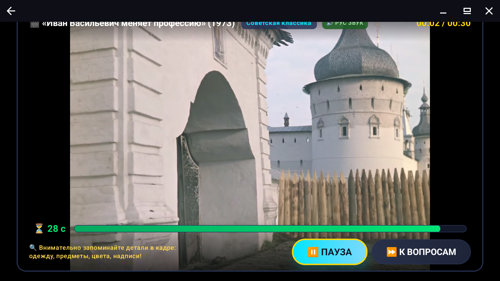
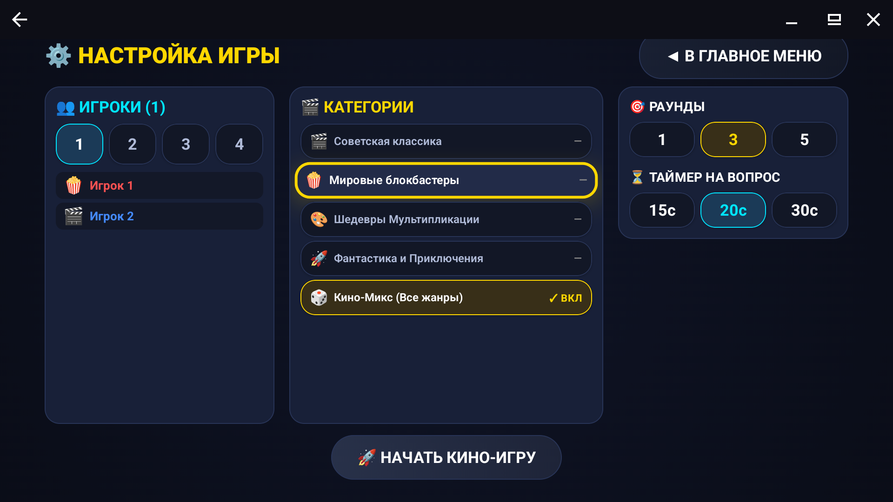
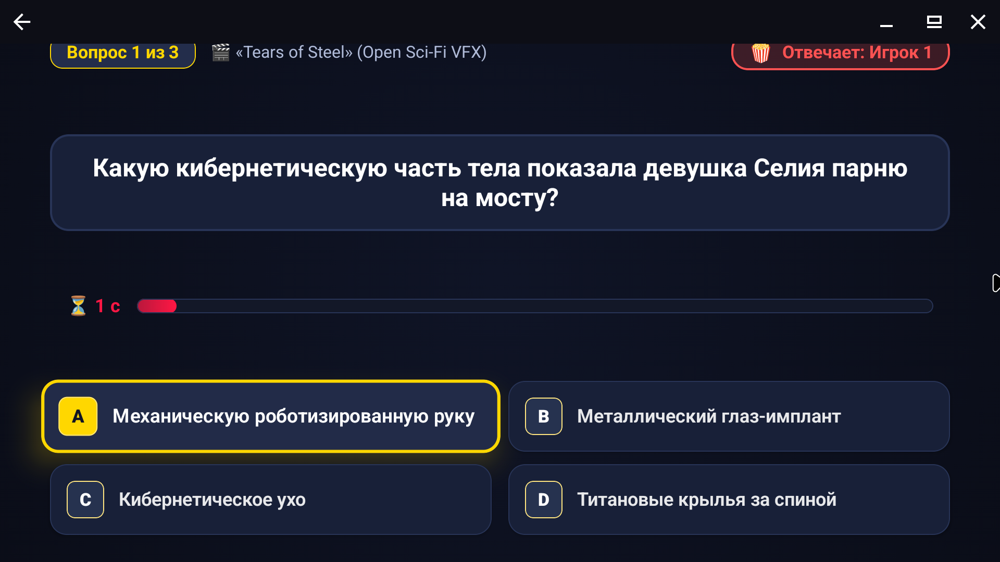
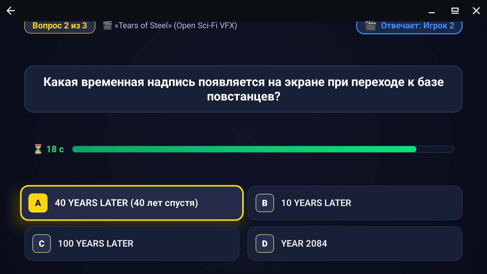

# 🎬 Стоп-Кадр (StopFrame) — Кино-викторина для Android TV

**«Стоп-Кадр»** — интерактивная командная игра для вечеринок и семейного досуга на **Android TV / Google TV**, приставках и планшетах.

---

## 📥 Скачать приложение

👉 **[Скачать StopFrame v1.0.0 Release APK (14 MB)](releases/StopFrame-v1.0.0-release.apk)**  
*Подписано официальным релизным ключом. Готово к установке через USB-флешку или ADB на любой телевизор или приставку с Android 8.0+ (minSdk 26).*

---

## 📸 Скриншоты геймплея

| Воспроизведение отрывка в 1080p | Настройка раундов и категорий |
| :---: | :---: |
|  |  |

| Вопросы викторины | Проверка ответа и объяснение деталей |
| :---: | :---: |
|  |  |

---

## 🎮 Как играть

1. **Смотрите фрагмент (30 сек):** На экране воспроизводится яркий киноэпизод в высоком качестве с русским звуком. Внимательно запоминайте детали: во что одеты герои, какие предметы в кадре, цвета, надписи и фоновые события.
2. **📸 СТОП-КАДР:** По истечении 30 секунд экран замирает — включается режим викторины!
3. **Отвечайте на вопросы:** 3 вопроса разной ценности (100, 150, 200 очков) строго по просмотренному моменту.
4. **Соревнуйтесь компанией (1–4 игрока):** Играйте с одного пульта! Выбирайте количество игроков, накапливайте комбо-множители и завоевывайте кинозвания в финальной таблице лидеров.

---

## 🎞️ Каталог видео в репозитории

Все видеоролики закодированы в совместимый профиль **H.264 High@L4.0 (1080p)** со звуком **AAC Stereo** и воспроизводятся плеером через прямой GitHub-стриминг:

| ID / Файл | Название фильма | Год / Студия | Жанр |
| :--- | :--- | :---: | :--- |
| `soviet_ivan_vasilievich.mp4` | «Иван Васильевич меняет профессию» | 1973 / Мосфильм | Советская классика |
| `soviet_operation_y.mp4` | «Операция «Ы» и другие приключения Шурика» | 1965 / Мосфильм | Советская классика |
| `soviet_diamond_arm.mp4` | «Бриллиантовая рука» | 1968 / Мосфильм | Советская классика |
| `soviet_sluzhebny_roman.mp4` | «Служебный роман» | 1977 / Мосфильм | Советская классика |
| `wb_harry_potter.mp4` | «Гарри Поттер и философский камень» | 2001 / Warner Bros. | Мировые блокбастеры |
| `wb_lotr_fellowship.mp4` | «Властелин Колец: Братство Кольца» | 2001 / New Line Cinema | Мировые блокбастеры |
| `anim_big_buck_bunny.mp4` | «Big Buck Bunny» | Blender Open Movie | Мультипликация |
| `anim_sintel.mp4` | «Sintel» | Blender Open Movie | Мультипликация |
| `anim_caminandes_llamigos.mp4`| «Caminandes: Llamigos» | Blender Open Movie | Мультипликация |
| `anim_spring.mp4` | «Spring» | Blender Open Movie | Мультипликация |
| `scifi_tears_of_steel.mp4` | «Tears of Steel» | Blender VFX Studio | Фантастика |
| `scifi_elephants_dream.mp4` | «Elephants Dream» | Orange Open Movie | Фантастика |
| `scifi_agent_327.mp4` | «Agent 327: Operation Barbershop» | Blender Animation Studio | Приключения |

---

## 🕹️ Управление пультом Android TV

- **Стрелки (D-pad Up/Down/Left/Right):** Навигация между кнопками, категориями и вариантами ответов.
- **Центральная кнопка (OK / D-pad Center):** Выбрать ответ / Начать игру / Пауза / Переход к вопросам.
- **Кнопка «Назад» (Back):** Возврат в главное меню или отмена.

---

## 🛠️ Технические подробности сборки
- **Репозиторий исходного кода:** [https://github.com/snakelair/StopFrame](https://github.com/snakelair/StopFrame)
- **Стек:** Kotlin, Jetpack Compose for TV, Material 3, AndroidX Media3 ExoPlayer, SoundPool.
- **Минимальная версия:** Android 8.0 Oreo (API 26).
- **Целевая версия:** Android 14/15 (API 35).
