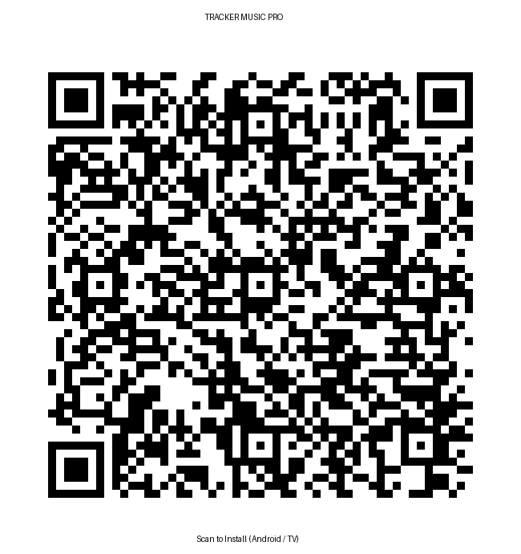

# 🎵 Tracker Music PRO — Плеер демосцены для Android & Android TV

**Tracker Music PRO** — официальный полноэкранный нативный клиент трекерной музыки демосцены и кейгенов для **Android-планшетов, смартфонов, автомобильных ГУ (Android Auto/Head Units) и телевизоров Android TV / Google TV**.

---

## 📥 Скачать и установить на планшет, телевизор или смартфон

### Вариант 1. Сканировать QR-код планшетом или телефоном
Откройте камеру планшета или смартфона и наведите на QR-код для прямой загрузки APK:

  

### Вариант 2. Прямая ссылка для скачивания
🚀 **[Скачать TrackerMusic v1.0.2 Release APK (2.75 МБ)](https://raw.githubusercontent.com/snakelair/Android/main/TrackerMusic/releases/TrackerMusic-v1.0.2-release.apk)**  
*(Предыдущие версии: [releases/TrackerMusic-v1.0.1-release.apk](releases/TrackerMusic-v1.0.1-release.apk), [releases/TrackerMusic-v1.0.0-release.apk](releases/TrackerMusic-v1.0.0-release.apk))*

> [!NOTE]
> Приложение подписано официальным релизным ключом SnakeLair и готово к установке на любое устройство с **Android 8.0+ (minSdk 26)** — планшеты, телефоны, Android TV, Google TV, ТВ-приставки (Xiaomi Mi Box, Dune, Ugoos, SberBox), проекторы и головные устройства авто.

---

## ⚡ Что нового в версии 1.0.2

- 🔄 **Встроенная система самообновления (In-App Self-Update):**
  - Автоматическая проверка новых версий в репозитории при старте приложения.
  - Показ диалога с описанием обновлений (с фокусом на кнопке «Обновить» для пультов ТВ).
  - Умная защита от спама: при нажатии **«Позже»** повторное напоминание откладывается на **7 дней**, либо показывается мгновенно при выходе ещё более свежего релиза.
  - Внутриигровое скачивание APK с прогресс-баром и бесшовный запуск системного установщика пакетов (`FileProvider`).
- 🔗 **Поддержка Deep Links (App Links):** Прямой перехват и открытие ссылок `https://tracker.snakelair.ru/?track=<id>` прямо в приложении.
- 🎧 **Внешнее управление (MediaSession API + Bluetooth / Авто / Гарнитуры):** Управление со стандартных кнопок Bluetooth-гарнитур, мультируля в авто и пульта ТВ.
- 🎯 **Умная предзагрузка трека (без автозапуска):** Автоматическая загрузка популярного трека или последнего прослушанного в режиме паузы.

---

## ✨ Особенности приложения

- ⚡ **Нативный синтез libopenmpt WebAssembly**: Точное студийное воспроизведение форматов .MOD, .XM, .S3M, .IT прямо на устройстве без транскодирования.
- 🌌 **5 интерактивных 3D WebGL сцен**: Аудио-реактивные ретро-сцены демосцены (Synthwave Grid, Hyperspace Warp, Demoscene Core, Voxel Sea, Cyber Megapolis).
- 🎛️ **8-канальный пульт Mute & Solo**: Поканальная изоляция и анализ дорожек в реальном времени.
- 📊 **FastTracker II Matrix Pattern View**: Бегущая матрица нот и строк паттерна синхронно со звуком.
- 💾 **1,280+ культовых треков демосцены**: Razor 1911, SKiD ROW, TSRh, Fairlight, Paradox, Deviance, Future Crew, Amiga Classics и фанатские ремиксы.
- 📺 **Полная поддержка Android TV и пультов ДУ**:
  - Отображение баннера 16:9 в лаунчере Google TV / Android TV.
  - Управление кнопками D-pad (стрелки, OK).
  - Аппаратные медиа-кнопки (Play/Pause, Next Track, Previous Track).
  - Режим Keep Screen On — экран не гаснет во время работы визуализатора.

---

## 🎮 Управление пультом и Bluetooth-устройствами

| Кнопка | Действие |
| :--- | :--- |
| **D-pad Left / Right / Up / Down** | Навигация по интерфейсу, переключение треков и режимов |
| **D-pad Center / OK / Enter** | Выбрать трек / Нажать кнопку / Воспроизведение |
| **Play / Pause (⏯️)** | Пауза / Возобновление воспроизведения |
| **Next Track (⏭️)** | Следующий трек в плейлисте |
| **Previous Track (⏮️)** | Предыдущий трек |
| **Bluetooth / Мультируль авто** | Play / Pause / Next / Prev трек |
| **Назад (Back)** | Назад по истории страниц / Двойное нажатие для выхода |

---

## 📋 Техническая информация

- **Package ID:** com.snakelair.trackermusic
- **Версия:** 1.0.2 (versionCode 3)
- **Размер APK:** ~2.75 МБ
- **Min SDK:** Android 8.0 Oreo (API 26)
- **Target SDK:** Android 15 (API 35)
- **Цифровая подпись:** SHA-256 RSA 2048 (CN=TrackerMusic, OU=Dev, O=SnakeLair)
